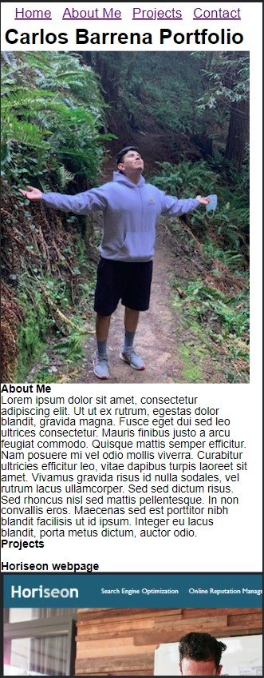

# Carlos Barrena Portfolio

## Description

This web page was created to serve as a professional portfolio. This website showcases responsiveness to different types of media, as well as serving as a platform of introduction on the creator.

## Installation

N/A

## Usage

To use this portfolio web page, you can use the navigation bar at the top to help navigate to different sections within the page. You can also view the webpage on different screen sizes without losing funcitonality.

[webpage link](https://barcar95.github.io/carlos-barrena-portfolio/)

## Credits

N/A

## License

Please refer to LICENSE in repo.